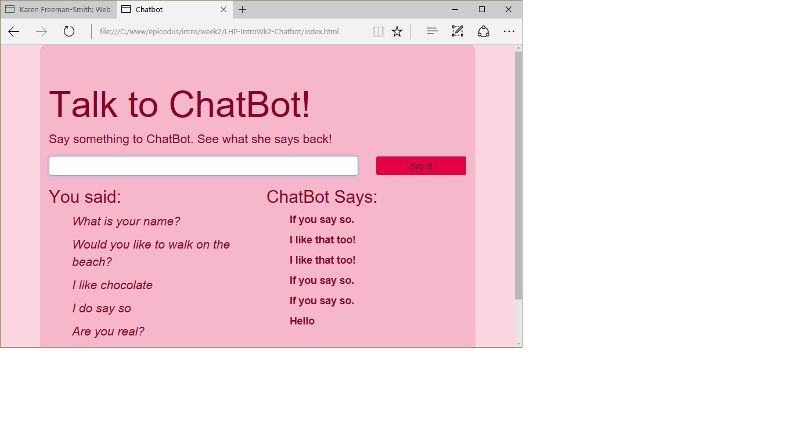

# Chatbot
Version 0.2.0: July 13, 2016
by [Karen Freeman-Smith](https://karenfreemansmith.github.io)

### Technologies Used
HTML, CSS/Sass, Bootstrap, JavaScript, jQuery, Angular.js, Gulp

## Description
*[Learn How To Program](http://learnhowtoprogram.com) Intro to Programming Week 2 Individual Project: A webpage talks back to the visitor.*

* Version 0.2.0 - converting to Angular.js app
* Version 0.1.0 - chatbot has a personality! See if you have anything in common
by telling her your favorite things.
* Version 0.0.2 - chatbot got a makeover so she's not so plain anymore

## Setup/Installation
* [View on Github Pages](https://karenfreemansmith.github.io/LHP-IntroWk2-Chatbot)
* _OR_
* Clone directory
* Open index.html in your favorite browser
* Run "npm install" to setup development environment for further improvements

## Support & Contact
For questions, concerns, or suggestions please email karenfreemansmith@gmail.com

## Known Issues
* None

## Legal
*Licensed under the GNU General Public License v3.0*

Copyright (c) 2016 Copyright _[Karen Freeman-Smith](https://karenfreemansmith.github.io)_ All Rights Reserved.
